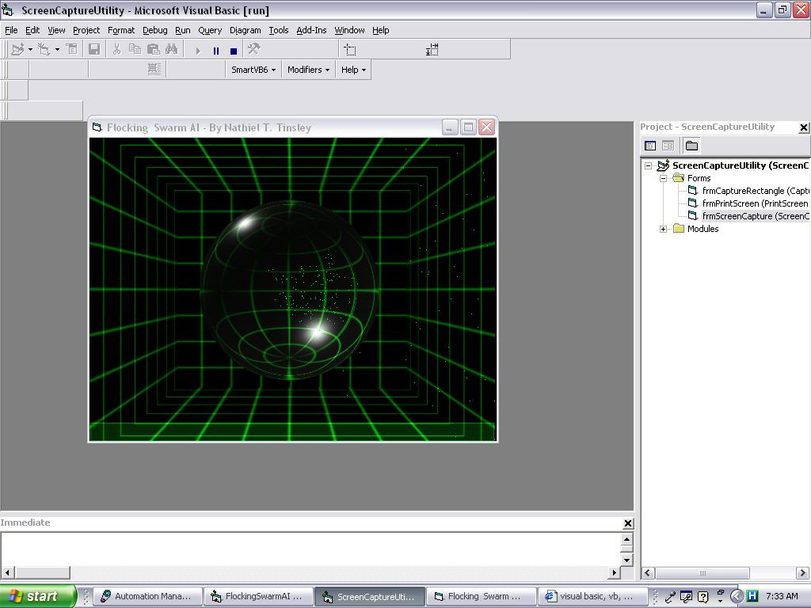



## VBFLOCK

### Description

The is an attempt to implement Craig Reynold's flocking algorithm in VB. The flocking algorithm has to do with crowd behavior or herd behavior. This program is a combination of two VB flocking programs that I found on the internet. I have combined them together to create this one program because the source codes were different but similar in both. If anyone wishes to optimized this program, then, by all means, do so. However, please send feedback of the outcome. For example, this program could be modified to use pictures instead of pixels. The program is to be somehow integrated into my on going VB AliceBot project, AI chatbot. If optimizations and suggestions shall be appreciated. I am not out for votes but just optimizations to programs that I submit; thus, eventually led to the completion of my AI project.

Sincere Thanks,

NTT
 
### More Info
 

             |
---                |---
**Submitted On**   |2006-02-28 06:35:16
**By**             |[Nathiel T\. Tinsley](https://github.com/Planet-Source-Code/PSCIndex/blob/master/ByAuthor/nathiel-t-tinsley.md)
**Level**          |Advanced
**User Rating**    |5.0 (15 globes from 3 users)
**Compatibility**  |VB 5\.0, VB 6\.0
**Category**       |[Complete Applications](https://github.com/Planet-Source-Code/PSCIndex/blob/master/ByCategory/complete-applications__1-27.md)
**World**          |[Visual Basic](https://github.com/Planet-Source-Code/PSCIndex/blob/master/ByWorld/visual-basic.md)
**Archive File**   |[VBFLOCK1976902282006\.zip](https://github.com/Planet-Source-Code/nathiel-t-tinsley-vbflock__1-64479/archive/master.zip)

